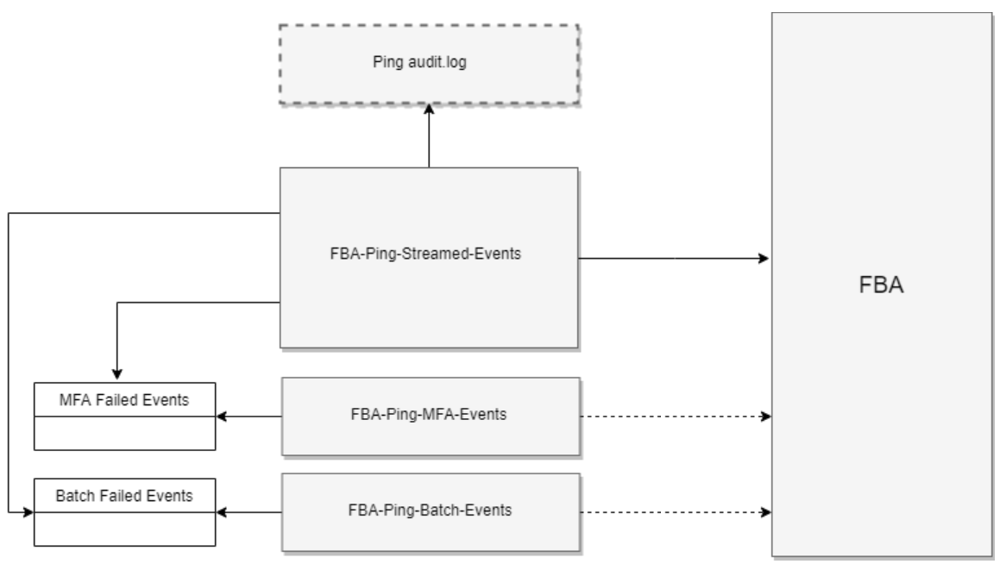

# Technical Overview

This was developed in order to capture PingFederate failed login events, locked out events and unsuccessful MFA events.

It consists of one service (FBA-Ping-Streamed-Events) and two jobs (FBA-Ping-Batch-Events, FBA-Ping-MFA-Events).

## FBA-Ping-Streamed-Events

This service does multiple things:

- Watch the Ping Audit Log in real time
- Sends any failed into FBA.
- Sends any locked out events into FBA.
- Process MFA events.
- It saves the events into a file for later processing in case FBA API's are down.
- In case this service is killed, once it's triggered again, it will pick up from were it left off and it will send all the missed previous events.

## FBA-Ping-MFA-Events

This job will pick failed MFA events due to lack of success MFA event and sends them into FBA.

## FBA-Ping-Batch-Events

This job will pick any events were missed due to FBA API's were down and sends them into FBA.



## Implementation

Prerequisites are : curl, grep, bc, logrotate and systemd.

Make sure shell scripts are executable.

Run ./deploy/install.sh

Run setup-user-config.sh or change values manually in user-config.sh located in home folder

Run ./deploy/setup.sh

Validate user input by running validate.sh located in source folder.

## NFS Server Setup

```bash
# install NFS libs
yum update && install -y nfs-utils nfs-utils-lib;

# Start the appropriate NFS services on the server.
chkconfig nfs on
service rpcbind start
service nfs start
service nfslock start

# Now we need to make an entry in “/etc/exports”. (replace IP_ADDRESS with the client IP Address)
vi /etc/exports
/usr/local/pingfederate-9.2.0/pingfederate/log IP_ADDRESS(ro,async,no_subtree_check)

# restart the services to make our directory shareable in the network.
service nfs reload

# check if client is connected:

# Server side
netstat -an | grep 2049
# Client side
df -kh
```

## Docker

Package deployment first, then run image build.

```bash
./build/create-deployment.sh && \
docker build -t fp-fba-failed-logins-importer-ping .
```

Edit cfg.env file first and then create container:

```bash
docker run -itd --cap-add=SYS_ADMIN --security-opt apparmor:unconfined \
   --name fp-fba-failed-logins-importer-ping \
   --env-file $PWD/cfg.env \
   fp-fba-failed-logins-importer-ping
```

Another way to run a container without cfg.env, create user-config.sh and run below with PING_NFS_MAPPING

```bash
docker run -itd --cap-add=SYS_ADMIN --security-opt apparmor:unconfined \
   --name fp-fba-failed-logins-importer-ping \
   -v $PWD/user-config.sh:/usr/fp-fba-failed-logins-importer-ping/user-config.sh \
   --env PING_NFS_MAPPING=<ping-server-host-name:nfs_log_dir> \
   fp-fba-failed-logins-importer-ping
```

Another way to run a container without NFS setup and without cfg.env, create user-config.sh and run the container on host where ping server resides and map the log file

```bash
docker run -itd \
   --name fp-fba-failed-logins-importer-ping \
   -v $PWD/user-config.sh:/usr/fp-fba-failed-logins-importer-ping/user-config.sh \
   -v <host-ping-log-dir>:/mnt/ping/logs \
   fp-fba-failed-logins-importer-ping
```
